# Claude Pinger

An automated Cloudflare Worker service that periodically keeps your Claude.ai 5-hour rolling usage limit active across multiple accounts using headless browser automation.

---

## Overview

Claude.ai uses a 5-hour rolling usage limit window that only begins counting down after your first message is sent. **Claude Pinger** runs as a serverless Cloudflare Worker scheduled via cron triggers. It automatically logs into your Claude accounts via [Browserless](https://www.browserless.io/) (headless Puppeteer), sends a lightweight keep-alive ping, and opens your fresh 5-hour usage window without manual intervention.

---

## Features

- **Multi-Account Support**: Simultaneously keeps multiple Claude accounts active in a single execution.
- **Ultra-Low Token Usage**: Uses prompt engineering (`"ping. Reply with '.' only."`) to limit output to a single character (`.`), preserving 99.99% of your message quota.
- **Single Thread Reuse**: Reuses dedicated chat threads (e.g. `Ping test`) to prevent sidebar clutter.
- **Direct & Fallback Navigation**: Supports direct chat URLs (`CLAUDE_CHAT_URL_1`) with automated fallback searching on `/recents`.
- **Cloudflare Stealth Evasion**: Masks browser automation flags (`navigator.webdriver`, User-Agent spoofing, HTTP header overrides) to pass bot verification checks.
- **Zero Secrets Leakage**: All API keys, session keys, and chat URLs are encrypted in Cloudflare Worker Secrets — zero hardcoded credentials in source code.

---

## Architecture

```mermaid
flowchart LR
    A[Cloudflare Worker Cron Trigger] -->|Scheduled / Manual POST| B[Worker Execution Engine]
    B -->|Fetch with Secrets & ESM Code| C[Browserless API]
    C -->|Puppeteer Stealth Session| D[Claude.ai Web App]
    D -->|Inject Session Cookie| E[Authenticate Account]
    E -->|Open Pinger Chat & Type Ping| F[Keep-Alive 5h Window Started]
```



---

## Getting Started

### Prerequisites

1. **Node.js** (v18+) & **Cloudflare Wrangler CLI**:
   ```bash
   npm install -g wrangler
   ```
2. **Browserless API Token**:
   - Sign up at [browserless.io](https://www.browserless.io/) to get your API token.
3. **Claude Session Key(s)**:
   - Log into [claude.ai](https://claude.ai) in your browser.
   - Open DevTools (`F12`) -> **Application** -> **Cookies** -> `https://claude.ai`.
   - Copy the value of the `sessionKey` cookie (starts with `sk-ant-sid02-...`).

---

## Installation & Setup

1. **Clone the Repository**:
   ```bash
   git clone https://github.com/shlokkokk/claude-pinger.git
   cd claude-pinger
   ```

2. **Configure Cloudflare Secrets**:

   Set your Browserless API token:
   ```bash
   wrangler secret put BROWSERLESS_TOKEN
   ```

   Set your primary Claude account session key:
   ```bash
   wrangler secret put CLAUDE_SESSION_KEY
   ```

   *(Optional)* Set secondary account session keys:
   ```bash
   wrangler secret put CLAUDE_SESSION_KEY_2
   ```

   *(Optional)* Set direct chat thread URLs for instant navigation:
   ```bash
   wrangler secret put CLAUDE_CHAT_URL_1
   wrangler secret put CLAUDE_CHAT_URL_2
   ```

3. **Deploy to Cloudflare Workers**:
   ```bash
   wrangler deploy
   ```

---

## Schedule Configuration

The cron schedule uses a **dual-account staggered system** with an exact **+2 minute safe buffer** to prevent early-ping race conditions (4 runs per account, 8 total per day):

- **🔵 Account 1 (`shlokshah412`)**:
  - `58 4 * * *` (10:28 AM IST)
  - `0 10 * * *` (03:30 PM IST)
  - `2 15 * * *` (08:32 PM IST)
  - `4 20 * * *` (01:34 AM IST)

- **🟣 Account 2 (`pcgpt`)**:
  - `0 2 * * *` (07:30 AM IST)
  - `2 7 * * *` (12:32 PM IST)
  - `4 12 * * *` (05:34 PM IST)
  - `6 17 * * *` (10:36 PM IST)

Together, they provide alternating fresh limit resets **every ~2.5 to 3 hours** across your day with zero overlapping collisions.

---

## Testing

Trigger a manual execution anytime:

```bash
curl -X POST https://<your-worker-subdomain>.workers.dev
```

Expected JSON response:

```json
{
  "message": "Multi-account ping finished!",
  "results": [
    {
      "account": "Account 1 (shlokshah412)",
      "result": {
        "success": true,
        "url": "https://claude.ai/chat/07e9f80b-e9b6-4b28-a2c2-4675458f541b",
        "pageTitle": "Ping test - Claude",
        "actionExecuted": true,
        "stepError": null
      }
    }
  ]
}
```

---
