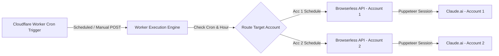

# Claude Pinger

An automated Cloudflare Worker service that periodically keeps your Claude.ai 5-hour rolling usage limit active across multiple accounts using headless browser automation.

---

## Overview

Claude.ai uses a 5-hour rolling usage limit window that only begins counting down after your first message is sent. **Claude Pinger** runs as a serverless Cloudflare Worker scheduled via cron triggers. It automatically logs into your Claude accounts via [Browserless](https://www.browserless.io/) (headless Puppeteer), sends a lightweight keep-alive ping, and opens your fresh 5-hour usage window without manual intervention.

---

## Features

- **Dual-Account Staggered Scheduling**: Alternates pings between multiple accounts every ~2.5 to 3 hours, giving you continuous rolling limits throughout the day.
- **Race Condition Prevention**: Incorporates an exact **+2 minute safe buffer** after every 5-hour window expiry, eliminating early-ping collisions.
- **Free Tier Cloudflare Optimization**: Smartly compresses 8 daily runs across 2 accounts into **5 Cloudflare cron triggers** to strictly comply with Cloudflare Workers Free Tier limits.
- **Single & Multi-Account Testing**: Supports testing all accounts or targeting a specific account on-demand using query parameters (`?account=1` or `?account=2`).
- **Ultra-Low Token Usage**: Uses prompt engineering (`"ping. Reply with '.' only."`) to limit output to a single character (`.`), preserving 99.99% of your message quota.
- **Single Thread Reuse**: Reuses dedicated chat threads (e.g. `Ping test`) to prevent sidebar clutter.
- **Direct & Fallback Navigation**: Supports direct chat URLs (`CLAUDE_CHAT_URL_1`) with automated fallback searching on `/recents`.
- **Cloudflare Stealth Evasion**: Masks browser automation flags (`navigator.webdriver`, User-Agent spoofing, HTTP header overrides) to pass bot verification checks.
- **Zero Secrets Leakage**: All API keys, session keys, and chat URLs are encrypted in Cloudflare Worker Secrets — zero hardcoded credentials in source code.

---

## Architecture



---

## Getting Started

### Prerequisites

1. **Node.js** (v18+) & **Cloudflare Wrangler CLI**:
   ```bash
   npm install -g wrangler
   ```
2. **Browserless API Token**:
   - Sign up at [browserless.io](https://www.browserless.io/) to get your API token.
3. **Claude Session Key(s)**:
   - Log into [claude.ai](https://claude.ai) in your browser.
   - Open DevTools (`F12`) -> **Application** -> **Cookies** -> `https://claude.ai`.
   - Copy the value of the `sessionKey` cookie (starts with `sk-ant-sid02-...`).

---

## Installation & Setup

1. **Clone the Repository**:
   ```bash
   git clone https://github.com/<your-username>/claude-pinger.git
   cd claude-pinger
   ```

2. **Configure Cloudflare Secrets**:

   Set your Browserless API token:
   ```bash
   wrangler secret put BROWSERLESS_TOKEN
   ```

   Set your primary Claude account session key:
   ```bash
   wrangler secret put CLAUDE_SESSION_KEY
   ```

   *(Optional)* Set secondary account session keys:
   ```bash
   wrangler secret put CLAUDE_SESSION_KEY_2
   ```

   *(Optional)* Set direct chat thread URLs for instant navigation:
   ```bash
   wrangler secret put CLAUDE_CHAT_URL_1
   wrangler secret put CLAUDE_CHAT_URL_2
   ```

3. **Deploy to Cloudflare Workers**:
   ```bash
   wrangler deploy
   ```

---

## Schedule Configuration

The cron schedule uses a **dual-account staggered system** with an exact **+2 minute safe buffer** to prevent early-ping race conditions (4 runs per account, 8 total per day):

| Time (IST) | Target Account | Cloudflare Cron (UTC) | Active Window | Purpose |
| :---: | :---: | :---: | :---: | :--- |
| **07:30 AM** | 🟣 **Account 2** | `0 2,10 * * *` *(UTC 2)* | `07:30 AM ➔ 12:30 PM` | Early Morning Start |
| **10:28 AM** | 🔵 **Account 1** | `58 4 * * *` | `10:28 AM ➔ 03:28 PM` | **Morning Workday Start** |
| **12:32 PM** | 🟣 **Account 2** | `2 7,15 * * *` *(UTC 7)* | `12:32 PM ➔ 05:32 PM` | Lunchtime Switch *(+2m buffer)* |
| **03:30 PM** | 🔵 **Account 1** | `0 2,10 * * *` *(UTC 10)* | `03:30 PM ➔ 08:30 PM` | Afternoon Sprint *(3:30 on the dot)* |
| **05:34 PM** | 🟣 **Account 2** | `4 12,20 * * *` *(UTC 12)* | `05:34 PM ➔ 10:34 PM` | Post-Work / Tea Break *(+2m buffer)* |
| **08:32 PM** | 🔵 **Account 1** | `2 7,15 * * *` *(UTC 15)* | `08:32 PM ➔ 01:32 AM` | Evening Session *(+2m buffer)* |
| **10:36 PM** | 🟣 **Account 2** | `6 17 * * *` | `10:36 PM ➔ 03:36 AM` | Peak Night Deep Work *(+2m buffer)* |
| **01:34 AM** | 🔵 **Account 1** | `4 12,20 * * *` *(UTC 20)* | `01:34 AM ➔ 06:34 AM` | Late-Night Wrap-up *(+2m buffer)* |

Together, they provide alternating fresh limit resets **every ~2.5 to 3 hours** across your day with zero overlapping collisions.

---

## Testing & Manual Triggers

Trigger a manual execution anytime:

- **Ping All Accounts**:
  ```bash
  curl "https://<your-worker-subdomain>.workers.dev"
  ```

- **Ping Account 1 Only**:
  ```bash
  curl "https://<your-worker-subdomain>.workers.dev?account=1"
  ```

- **Ping Account 2 Only**:
  ```bash
  curl "https://<your-worker-subdomain>.workers.dev?account=2"
  ```

Expected JSON response:

```json
{
  "message": "Ping finished!",
  "results": [
    {
      "account": "Account 1",
      "result": {
        "success": true,
        "url": "https://claude.ai/chat/<chat-id>",
        "pageTitle": "Ping test - Claude",
        "actionExecuted": true,
        "stepError": null
      }
    }
  ]
}
```
