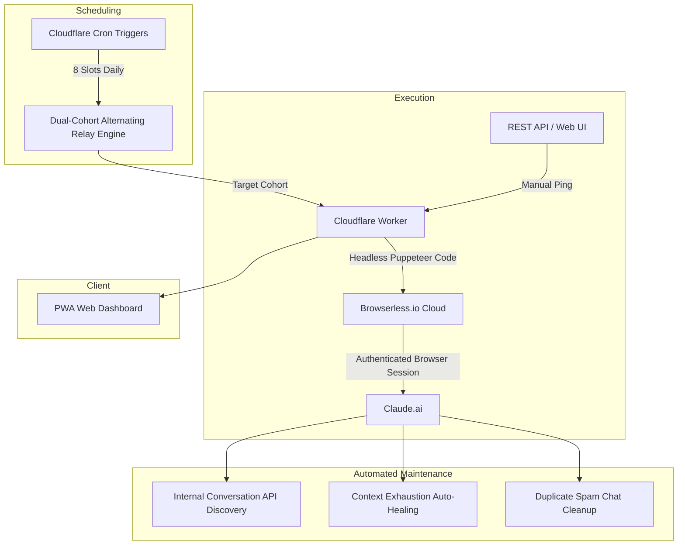

# Claude Pulse / Claude Pinger

Automated, multi-account usage window autopilot and keep-alive service for Claude.ai. Built as a serverless Cloudflare Worker orchestrating headless Puppeteer sessions via Browserless, accompanied by a responsive real-time web dashboard.

---

## Overview

Claude.ai enforces a rolling 5-hour usage limit window that only begins counting down after an initial message is sent. Claude Pinger automates this workflow:
- Periodically initiates lightweight keep-alive pings across multiple registered accounts.
- Maintains rolling session availability throughout the day using a dual-cohort alternating relay schedule.
- Automatically discovers active threads, clears duplicate chats, and heals broken sessions when message limits are reached.

The project consists of two core components:
1. **Cloudflare Worker Service**: Executes scheduled cron triggers and exposes REST API endpoints for manual execution and health telemetry.
2. **Real-Time Web Dashboard**: Responsive single-page application providing live telemetry, countdown timers, intelligent account recommendations, and one-tap manual pings.

---

## System Architecture


```mermaid
flowchart TD
    subgraph Scheduling
        CRON[Cloudflare Cron Triggers] -->|8 Slots Daily| RELAY[Dual-Cohort Alternating Relay Engine]
    end

    subgraph Execution
        RELAY -->|Target Cohort| WORKER[Cloudflare Worker]
        API[REST API / Web UI] -->|Manual Ping| WORKER
        WORKER -->|Headless Puppeteer Code| BL[Browserless.io Cloud]
        BL -->|Authenticated Browser Session| CLAUDE[Claude.ai]
    end

    subgraph Auto_Maintenance[Automated Maintenance]
        CLAUDE --> DISCOVERY[Internal Conversation API Discovery]
        CLAUDE --> HEALING[Context Exhaustion Auto-Healing]
        CLAUDE --> CLEANUP[Duplicate Spam Chat Cleanup]
    end

    subgraph Client_Interfaces[Client]
        WORKER --> DASHBOARD[PWA Web Dashboard]
    end
```

---

## Core Capabilities

### 1. Dual-Cohort Alternating Relay Engine
Accounts are dynamically partitioned into two alternating relay cohorts:
- **Cohort A**: First partition of accounts (`floor(N / 2)`).
- **Cohort B**: Second partition of accounts.

| Account Count | Cohort A (Wave 1) | Cohort B (Wave 2) | Execution Cadence |
| :--- | :--- | :--- | :--- |
| 1 Account | Account 1 | Account 1 | Pings every slot |
| 2 Accounts | Account 1 | Account 2 | 1 account, then 1 account |
| 3 Accounts | Account 1 | Account 2, Account 3 | 1 account, then 2 accounts |
| 4 Accounts | Account 1, Account 2 | Account 3, Account 4 | 2 accounts, then 2 accounts |
| 5 Accounts | Account 1, Account 2 | Account 3, Account 4, Account 5 | 2 accounts, then 3 accounts |

Each individual account is pinged once every approximately 5 hours (matching Claude's reset window), while the relay alternates every approximately 2.5 hours so that at least one account always has freshly available capacity.

### 2. Autonomous Thread Discovery
The service queries Claude's internal organization API (`/api/organizations/{org_id}/chat_conversations`) from within the authenticated session to locate the most recent active ping thread. If found, it reuses that thread rather than creating unnecessary new conversations.

### 3. Context Exhaustion Auto-Healing
If a thread reaches Claude's context boundary or presents a "conversation has grown too long" warning, the engine detects this condition and transparently migrates to `https://claude.ai/new` to initiate a fresh thread.

### 4. Automated Cleanup of Duplicate Threads
During each run, the worker queries existing conversations and identifies stale or orphaned keep-alive threads, pruning up to five older duplicate chats per execution via Claude's internal REST endpoints.

### 5. Bot Mitigation Evasion
Puppeteer sessions are executed with `navigator.webdriver` overrides, modern Chrome desktop User-Agent headers, and language preferences to prevent security blocks.

### 6. Minimal Token Footprint
The prompt explicitly instructs Claude: `"ping. Reply with '.' only."`, restricting consumption to a single token and preserving practically 100% of your usage allocation.

---

## Daily Schedule Matrix

The 8 daily execution slots are compressed into 5 standard cron triggers to remain strictly within Cloudflare Workers Free Tier limits:

| Slot | Time (IST) | Target Cohort | Cloudflare Cron (UTC) | Purpose |
| :---: | :---: | :---: | :---: | :--- |
| 1 | 01:34 AM | Cohort A | `4 12,20 * * *` (UTC 20) | Late-night session maintenance (+2m buffer) |
| 2 | 07:30 AM | Cohort B | `0 2,10 * * *` (UTC 2) | Early morning initialization |
| 3 | 10:28 AM | Cohort A | `58 4 * * *` | Workday morning start |
| 4 | 12:32 PM | Cohort B | `2 7,15 * * *` (UTC 7) | Midday transition (+2m buffer) |
| 5 | 03:30 PM | Cohort A | `0 2,10 * * *` (UTC 10) | Afternoon sprint |
| 6 | 05:34 PM | Cohort B | `4 12,20 * * *` (UTC 12) | Early evening handover (+2m buffer) |
| 7 | 08:32 PM | Cohort A | `2 7,15 * * *` (UTC 15) | Evening work block (+2m buffer) |
| 8 | 10:36 PM | Cohort B | `6 17 * * *` | Night session rollover (+2m buffer) |

---

## Setup and Deployment Guide

Follow this step-by-step guide to deploy the entire stack from scratch to your own Cloudflare account.

### Step 1: Install Prerequisites
Ensure you have Node.js (v18 or higher) installed on your machine.

1. Install the Cloudflare Wrangler CLI globally (or use `npx wrangler`):
   ```bash
   npm install -g wrangler
   ```
2. Authenticate Wrangler with your Cloudflare account:
   ```bash
   wrangler login
   ```
   This opens your browser to authorize CLI access to your Cloudflare account.

### Step 2: Obtain Browserless API Token
Headless browser automation executes remotely via Browserless so you do not need to run local Chromium instances:

1. Sign up for a free account at [browserless.io](https://www.browserless.io/).
2. Navigate to your Browserless dashboard and copy your **API Token**.

### Step 3: Extract Claude Session Key(s)
Extract the authentication cookie for each Claude account you wish to automate:

1. In Google Chrome, Microsoft Edge, or Brave, open [claude.ai](https://claude.ai) and sign into your account.
2. Open Developer Tools (`F12` or right-click anywhere and select **Inspect**).
3. Switch to the **Application** tab (in Firefox, this is the **Storage** tab).
4. In the left navigation tree, expand **Cookies** and select `https://claude.ai`.
5. Locate the cookie named `sessionKey`.
6. Double-click the cookie's value and copy the entire string (starts with `sk-ant-sid02-...`).
7. *(For additional accounts)* Open an Incognito window or a separate browser profile, sign in to your second account, and repeat the steps above to obtain `sessionKey` for Account 2, Account 3, etc.

### Step 4: Clone Repository and Install Dependencies
```bash
git clone https://github.com/shlokkokk/claude-pinger.git
cd claude-pinger
npm install
```

### Step 5: Configure Cloudflare Secrets
Store your credentials securely in Cloudflare's encrypted key-value store. Run each command below and paste the corresponding value when prompted:

```bash
# 1. Browserless API Token
wrangler secret put BROWSERLESS_TOKEN           # [Required: Headless browser automation key]

# 2. Account 1 Credentials
wrangler secret put CLAUDE_SESSION_KEY          # [Required: Primary account sessionKey cookie]
wrangler secret put CLAUDE_ACCOUNT_NAME_1       # [Optional: Custom display label for Account 1]

# 3. Account 2 Credentials
wrangler secret put CLAUDE_SESSION_KEY_2        # [Optional: Second account sessionKey cookie]
wrangler secret put CLAUDE_ACCOUNT_NAME_2       # [Optional: Custom display label for Account 2]

# 4. Additional Accounts (N = 3, 4, 5, ...)
wrangler secret put CLAUDE_SESSION_KEY_N        # [Optional: Session key for Account N]
wrangler secret put CLAUDE_ACCOUNT_NAME_N       # [Optional: Custom display label for Account N]
```

The system automatically auto-discovers and registers every configured account index on startup without any hardcoded limit.

### Step 6: Deploy to Cloudflare
Deploy the worker and register the cron triggers with a single command:

```bash
wrangler deploy
```

Upon successful deployment, Wrangler will output your worker's live URL:
```text
Deployed claude-pinger triggers
  https://claude-pinger.<your-subdomain>.workers.dev
  schedule: 58 4 * * *
  schedule: 0 2,10 * * *
  schedule: 2 7,15 * * *
  schedule: 4 12,20 * * *
  schedule: 6 17 * * *
```

### Step 7: Verify and Test the Deployment

1. **Check System Diagnostics**:
   Open `https://<your-worker-subdomain>.workers.dev/api/health` in your browser. Verify that `status` reports `"healthy"`, `browserless.status` reports `"connected"`, and your configured accounts appear with their respective session lengths.

2. **Run a Live Test Ping**:
   Trigger an on-demand ping for Account 1 to verify end-to-end browser execution:
   ```bash
   curl -X POST "https://<your-worker-subdomain>.workers.dev/api/ping?account=1"
   ```
   A successful response confirms that Browserless launched Chromium, authenticated with Claude, located or created the keep-alive chat thread, submitted the ping, and cleaned up duplicate chats.

3. **Access the Web Dashboard**:
   Open `https://<your-worker-subdomain>.workers.dev/` in any browser (mobile or desktop). You can add this page to your home screen or install it as a PWA for real-time countdown telemetry and one-tap manual pings.

4. **Automated Operation**:
   No further action is required. Cloudflare's serverless infrastructure executes the cron schedule automatically across the day.

---

## API Reference

### Health and Diagnostics
`GET /api/health`

Returns service health, region information, and configured account status without exposing session tokens:

```json
{
  "status": "healthy",
  "timestamp": {
    "utc": "2026-09-26T16:05:56.134Z",
    "ist": "9/26/2026, 9:35:56 PM"
  },
  "worker": {
    "online": true,
    "region": "HKG",
    "totalAccounts": 2
  },
  "accounts": [
    { "id": 1, "name": "Account 1", "themeColor": "#00f2fe" },
    { "id": 2, "name": "Account 2", "themeColor": "#c084fc" }
  ],
  "browserless": {
    "status": "connected",
    "message": "Token Authenticated"
  }
}
```

### Manual Trigger
`GET /api/ping` or `POST /api/ping`

- **Ping All Accounts**:
  ```bash
  curl -X POST "https://<your-worker>.workers.dev/api/ping"
  ```
- **Ping Specific Account**:
  ```bash
  curl -X POST "https://<your-worker>.workers.dev/api/ping?account=1"
  ```

Sample response:
```json
{
  "message": "Ping finished!",
  "results": [
    {
      "account": "Account 1",
      "result": {
        "success": true,
        "url": "https://claude.ai/chat/afc319e3-98ba-4fa4-90d1-95f489d2d58f",
        "pageTitle": "Ping test - Claude",
        "actionExecuted": true,
        "threadDiscoveryMethod": "internal_api",
        "cleanedUpSpamCount": 1,
        "stepError": null
      }
    }
  ]
}
```

---

## Web Dashboard

Accessible by navigating to the worker root URL (`/`) in any browser. Features include:
- Real-time countdowns to next scheduled pings and limit window expirations.
- Intelligent recommendation banner based on current task mode (Quick vs Deep Work).
- Interactive 24-hour timeline lane for each account.
- Direct manual execution triggers with live visual feedback.
- Progressive Web App (PWA) support with offline caching and standalone display mode.

---

---

## Overnight Task Autopilot

The Overnight Task Autopilot allows users to queue prompts for execution at the exact moment their next 5-hour usage limit window resets.

### REST Endpoints

#### 1. Real-Time Chat URL Verification
- **Path**: `POST /api/queue/verify`
- **Payload**:
  ```json
  { "chatUrl": "https://claude.ai/chat/e48b1111-2222-3333-4444-555566667777", "accountId": 1 }
  ```
- **Response**:
  ```json
  {
    "valid": true,
    "chatId": "e48b1111-2222-3333-4444-555566667777",
    "chatType": "Standard Chat (UUID v4 Verified)",
    "normalizedUrl": "https://claude.ai/chat/e48b1111-2222-3333-4444-555566667777",
    "targetAccount": "Account 1"
  }
  ```

#### 2. Queue Task
- **Path**: `POST /api/queue`
- **Payload**:
  ```json
  { "accountId": 1, "chatUrl": "https://claude.ai/chat/...", "prompt": "continue analysis" }
  ```

#### 3. List Active Queued Tasks
- **Path**: `GET /api/queue`

#### 4. Cancel Queued Task
- **Path**: `DELETE /api/queue?accountId=1`

---

## Running Tests

Run the native test suite using Node:
```bash
npm test
```

---

## Security and Privacy Considerations

- **Zero Hardcoded Personal Identifiers**: Source code contains no private account handles or static chat IDs. All account metadata is resolved dynamically at runtime from environment secrets.
- **Session Protection**: Session keys are never transmitted to client browsers; all operations are conducted server-side within isolated Browserless execution containers.
- **Session Expiry Handling**: Expired session keys trigger structured error reporting to prevent unauthenticated infinite loops or hanging headless sessions.


